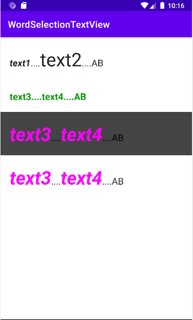

# Android FormatTextView
FormatTextView는 TextView를 상속받아 만든 커스텀 뷰입니다.
문장내에 특정 단락에 추가적인 스타일을 적용하거나, 단락을 클릭했을 때 이벤트를 받아 볼 수 있습니다.

FormatTextView is a custom view created by inheriting TextView.
You can apply additional styles to a specific paragraph within a sentence, or receive an event when you click a paragraph.

사용 방법은 간단합니다. 
`{}`안에 들어갈 FormatText만 정의해주고 `setText` 메소드를 호출해주면 됩니다. 

It's easy to use.
Just define FormatText to be in `{}` and call `setText` method.

```kotlin
val format = "{}....{}....ABC"
val text1 = FormatText("text1",20, R.color.teal_200, FormatText.BOLD_ITALIC)
val text2 = FormatText("text2",40)

formatText.setText(format, text1, text2)
formatText.setOnFormatTextClickListener { _, text ->
    Log.d(TAG, text.text)
}
```



